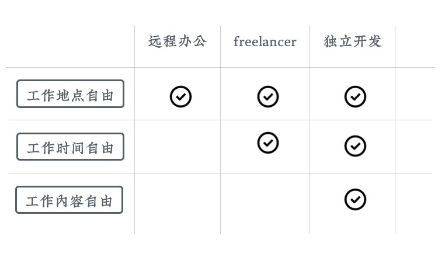

# 全新的工作自由度

接着上一节，我们来看看副业带来的、全新的工作自由度。这里我们多展望一下未来，主要是给大家鼓气。副业是很累的，要把别人用来休息的时间用到额外的工作上，多想想它的好处可以鼓励我们坚持下去。

当然，就像前边提过的，工作自由度最高当然是财务自由，上不上班都行，完全没有压力。我们这一节要讨论的是，在暂时还必须上班的情况下，我们可以取得的一些自由——我们就叫它「工作自由」吧。

我一般从三点上来看工作自由度：

1. 工作地点的自由
1. 工作时间的自由
1. 工作内容的自由。

不同的工作方式，有着不同的自由度。

 
## 远程办公

比如最近新冠流行，很多公司都开始搞远程办公了，有些大公司甚至宣布员工可以永久远程办公。远程办公这种工作方式，就实现了工作地点自由。你可以去公司的办公室、也可以在自己的家里，甚至是在旅游的路上办公。

但是，远程办公并没有实现工作时间和工作内容的自由，你依然要和其他人同时办公，区别只是以前面对面，现在改成视频了而已。

## freelancer

freelancer，就是那种在网上接单并收取报酬的工作者。这种工作方式在工作地点上同样是自由的，而且经常全部内容都是自己做，需要和别人沟通协调的内容不多，客户主要卡交工时间，只要能赶上进度，时间是可以自己安排的。所以它还实现了工作时间自由。

但freelancer没有实现工作内容自由，因为工作内容都是由客户指定的，绝大部分情况下，都不是你自己想要开发的东西。

## 独立开发

再来看独立开发这种工作方式。它通过售卖独立的软件、游戏或者在线服务来赚取收益。所以在工作地点、工作时间上都是自由的。

由于是自主售卖产品，它在工作内容上，也是自由的。

这里是举个例子，实际上还有很多在地点、时间和内容上都很自由的工作。比如网课讲师。

 

有意思的是，正是因为这些工作自由度高，所以适合作为副业来操作。反过来，一旦实际成熟，我们可以让副业反客为主，变成主业，从而随心所欲的掌控我们的日常工作。