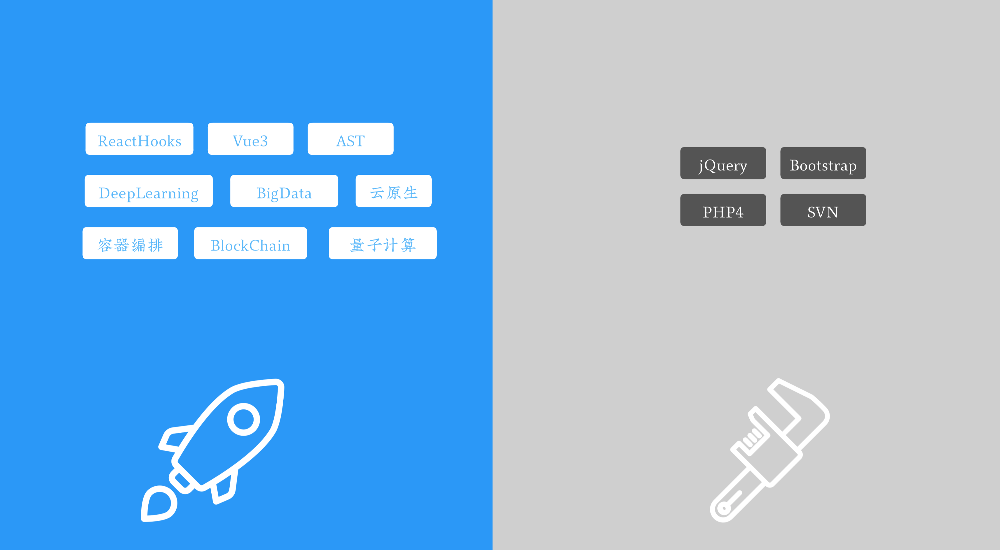

# 新技术练兵场

前边说的都是当职业需要跨象限的时候，副业能提供的可能性和自由度。但其实，即使你就想循规蹈矩地在一个固定的职业象限里发展，它也能提供非常大的帮助。

首先，副业可以成为新技术的练兵场。

现在社区里边吐槽得很多的一个现象是「面试造火箭，上班拧螺丝」。去面试一个前端岗位，问一些前端框架的最新版细节、底层原理，这是合理的，属于前端的业务范围。但如果把深度学习、大数据、云原生、容器编排、区块链甚至量子计算都拿来面试，就有点装了。

  

但是面试本质上就不是合格考试，而是竞争考试 —— 是要在一群人中选择最好的，所以这也还可以理解。但最不好理解的是，当我们过五关斩六将入职以后，发现这家公司还在用十年前的技术栈，代码管理用的还是 SVN。

不光是小公司、也不光是传统行业；甚至在一些互联网行业的大公司的某些部门里，也会出现这种情况。吐槽规吐槽，但为什么这种情况相当普遍呢？这其实是由于「技术债务驱动的架构更新」导致的。

什么是「技术债务驱动的架构更新」？

把时间拉回五年前，现在有一个业务需要上线，于是我们用当下（也就是五年前）最新的技术构建了这套系统。然后，随着时间慢慢过去，新技术不断涌出，但是线上系统依然能用，业务团队要求稳定；产品团队需要的是不断添加新功能；根本没有机会对技术栈本身进行大幅更新。虽然技术栈逐渐变得陈旧，但是「又不是不能用，理解万岁」嘛。在这种想法下，技术债务不断累积，直到有一天，技术债务快把整个架构压垮了，甚至业务被迫中止一两天后，公司终于决定了 —— 要重新整套系统。于是，又会选用当前时间点最先进的技术来重新开发一套全新的系统。所以你会发现很多公司的系统，它并不是持续不断地更新、不是随时保持最新；而是在新旧之间反复横跳。

由于五年中，业务变动的可能性和幅度都非常大，所以对公司来讲，重写系统是可能比维护系统更合理的。但对于那些在五年里一直用原来技术栈持续不断地维护旧系统的同学来讲，他们的技术栈被迫变旧了。

而当决定开发新系统的时候，公司又希望使用当下最新的技术栈。这就要求原系统的程序员在一瞬间学会新技术，并开发出一套稳定的系统来。大部分人是做不到的，但从公司的角度讲没有关系，淘汰掉，招聘新人组建新团队就好了，说不定成本还能更低点呢。

  

所以在这种结构的架构更新里边，如果程序员自己不想办法去学新技术，不去找地方去应用新技术，那么就像温水里的青蛙，最后终会用后即弃。

我很喜欢一句话，它听起来有些残酷，但真实，也时时推动着我去学习最新的技术。

> 一种新技术一旦开始流行，你要么坐上压路机，要么成为铺路石。 —— Stewart Brand

副业给了我们一个坐上压路机，避免被碾压的机会。程序员这个行业跟其他行业还不一样，它对新技术的要求并不只是认知，光知道新知识、了解新思路是不够的，还需要一个实打实的练手环境，花上相当长时间去踩坑，才能稳妥地做出一个稳定的方案。副业提供了一个真实业务，让我们可以把最新的技术用到上面，随时保持技术栈最新，增强主业的职业竞争力。
