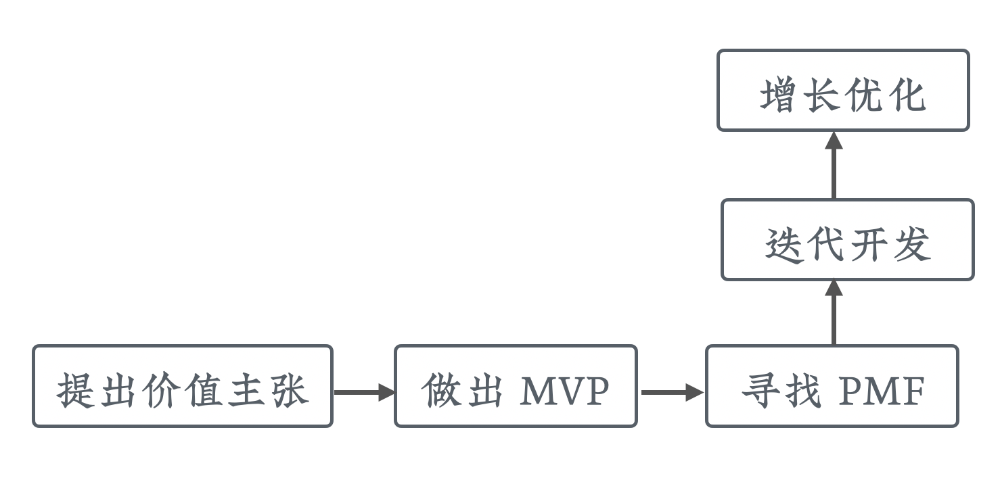

# 网课的精益流程

这一节开始，我们会将精益产品流程用到网课上。

## 网课和互联网产品更接近

有同学可能会想，你用互联网产品常用的精益流程来独立开发，这很好理解，但是网络课程，它为什么也适合用这种流程在做呢？

让我们来仔细看看网络课程。

它其实是一种跨界的产物，我们把网络课程这个词拆开，它包含了「网络」，又包含了「课程」。提到「课程」，大家想得更多的是线下培训；而提到「网络」，大家往往第一反应就是互联网产品。

因为「网络课程」以「课程」结尾，我们可能从语感上觉得它离课程更近一些。然而到底是不是这样呢？我们来比较一下。

  

- 从录制上来讲，网络课程使用电脑来制作，线下培训没有录制的这个环节。
- 学习上来讲，网络课程是在线进行学习，线下培训主要是现场教学。
- 从获客上来讲，网络课程主要是通过网络和社群来进行，线下培训主要依靠地面推广
- 从模式上来讲，网络课程通常是录制之后多次售卖，当然现在也有一些直播课；线下培训主要是按学期重复地进行讲授。

通过对比，我们可以看到网络课程和线下培训，不仅在学习方面有所差异，它们在最关键的获客和课程的模式上面有非常大的不同，而这两个环节会直接影响课程的销售。

我们接着再来对比一下网络课程和互联网产品。

  

- 在制作上，网络课程是通过电脑进行制作；互联网产品也是通过电脑进行开发
- 在使用上，网络课程是在线进行学习；互联网产品通常也是在线进行消费
- 在获客上，它们都是通过社交网络推广，利用搜索引擎、社群互动来进行获客
- 在模式上，网络课程是一次录制多次售卖；互联网产品是开发完成之后持续地进行使用

通过对比我们可以发现，网络课程其实和互联网产品在形态上更为接近。

这其实是一件好事，因为它跟互联网产品接近，就意味着说它更容易像互联网产品那样爆发式的增长，它的潜力也会更大。这可能就是在线教育现在发展得很好的原因。

基于以上理由，我们把互联网产品常用的精益创业流程进行优化，最终用到了网络课程上。从一年多的实践看，是非常有效的。

## 精益产品流程

这里我们复习一下上一节提到过的精益产品流程。

  

首先第一步，是提出我们的价值主张。然后根据价值主张制作最小可行产品（MVP）。通过 MVP 去寻找产品市场契合（PMF）。如果达到了我们预定的契合目标，就开始迭代式的开发；产品上线稳定后，会开始做一些增长方向上的优化，来提升我们产品的数据。

这个流程放到网课制作上，要进行相应的调整和优化。

  

- 提出价值主张，对应到选题和规划
- 制作 MVP ，对应到大纲
- 寻找产品市场的契合，对应到预售验证
- 迭代开发，对应到制作和后期
- 增长优化，对应到课程上线后的运营

看起来这个流程和传统课程制作流程没有特别大的差异，但是如果仔细观察，就会发现我们多了验证这个步骤，而且它放得非常靠前。

不要小看这个细节的改进，实际上它对我们的成本和风险的影响是非常大的。因为它可以在进入制作之前，就发现卖不掉的课程，帮我们省下大量的资源。

  

从上边这张对比图可以看出，如果一个课程在规划和选题上存在问题，那么假设在大纲处开始验证，它损失的成本是 1；那么等到销售时才发现，它的损失将是 3 到 5。

这种风险控制对于副业来讲，是非常重要的。