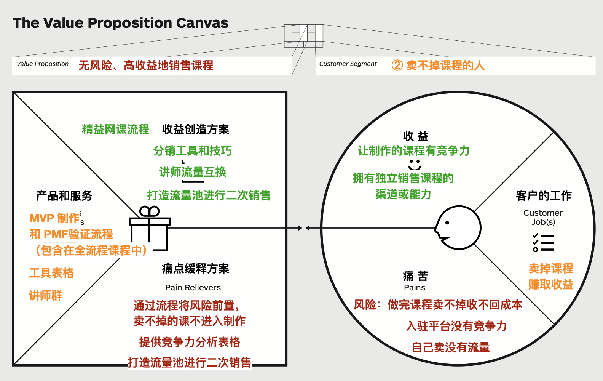

# 网课的商业模式设计

前边我们已经用过商业模式画布这个工具了，这次我们把它用到网课上。

这里，假设要将本书中的「精益网课变现」部分内容制作成一个付费视频网课（实际上还真的有这么一个课程，不过是在撰写本书之前制作的），我们来看看应该如何进行商业模式设计。

## 价值主张和客户细分

首先肯定是要定义价值，这就离不开价值主张和客户细分。我们将课程的核心用户分为两类：

1. 做不出课程的人
1. 卖不掉课程的人

为了深入理解客户细分，我们之前使用了「用户画像」工具，这次使用「价值主张画布」来做分析吧。这个画布我们在前边讲商业模式画布时介绍过，忘了的同学可以先复习下。

### 做不出课程的人的价值主张画布

#### 痛苦

什么样的人会做不出来课程呢？简单地分析一下，我觉得主要有两类：

1. 没有足够的时间和精力来做课程
1. 缺乏基本的知识和技能来做课程

于是我们把它写到右侧圆形的「痛苦」部分：

1. 没有足够的时间和精力
1. 不知道课程的制作流程
1. 不会音视频的后期

#### 工作

然后来看「客户的工作」。这里的工作，其实是一个广义的、泛化的概念，并不一定就非得是上班时要完成的任务，一些情绪上的、社交上的需求其实也都可以放到这个地方。所以我们写上：

1. 保持稳定的品质和产能持续制作课程
1. 获得成就感

#### 收益

再来看「收益」部分：

1. 学会快速做课的流程
1. 稳定的后期质量
1. 提升课程产出

这就是我们客户的情况。下边来看看如何针对这些情况提出价值主张。

#### 痛点缓释方案

先从痛点入手，来提供「痛点缓释方案」。

针对「不知道课程的制作流程」、「不会音视频的后期」的解决方案很直接，只需要提供详尽的流程和技能讲解就可以了。

而针对「没有足够的时间和精力」的问题，我们就要仔细想想了。首先，注意到「足够」这个词，它其实说明了两个问题，第一，客户还是有时间和精力在投入的，只是比较少。第二，学习做课以及实际做课需要消耗大量的时间和精力，与客户能投入的不匹配。

为了解决这个问题，我们有两种思路，一种是让客户增加投入，但在副业状态下不太现实。另一种思路，就是想办法大量削减学习做课和实际做课的时间和精力。

为了削减学习做课的时间和精力，据 8020 法则知道，在 80% 的时间里其实我们只会用到约 20% 的功能，那么我们可以只教授这 20% 最常用的部分功能，其他的知识可以在等学员遇到问题后，通过学员交流群或自行查找资料来解决。

而为了削减实际做课的时间和精力，我们则提供组队和众包服务。如果时间和精力不足以做完一个课程，那么可以几个人合作，拼起来完成一个课程。

#### 收益创造方案

再来看针对收益的创造方案。首先我们提供了基于精益副业的网课制作流程，速度更快、风险更小。然后我们可以引入人工智能和其他工具软件，提升课程的产出、稳定后期的质量。

组队和众包也可以进一步提升收益，所以我们也把它放到这里。

#### 产品和服务

有了「痛点缓释方案」和「收益创造方案」，我们需要把它们落地，这时候就需要具体的「产品和服务」。为了满足上边提到的需求，我们要提供的产品和服务如下：

1. 全流程覆盖的教学
1. 组队和众包群
1. 工具表格和提效技巧集

其中「工具表格和提效技巧集」可以包含在「全流程覆盖的教学」中。

最后，我们将价值主张归纳为一句话，那就是「多快好省地做课」。

  

以上就是完整的，针对「做不出课程的人」的价值主张画布。

### 卖不掉课程的人的价值主张画布

下边我们来看卖不掉课程的人。

#### 工作

很直接：

1. 卖掉课程
1. 赚取收益

####  痛点

1. 风险：做完课程卖不掉
1. 入驻平台没有竞争力
1. 自己销售没有流量

这里的风险我是有切身体会的。之前大概花了三个月的时间来做一个课程，最后总共就卖出去了两套。不光是收益问题，在情感方面的打击也是非常大的，好久都不想再做课了。

#### 收益

1. 让制作的课程有竞争力
1. 拥有独立销售课程的渠道和能力

#### 痛点缓释方案

针对痛点，提出以下缓释方案：

1. 通过精益网课流程，将风险前置，卖不掉的课不进入制作
1. 提供市场分析工具和竞争力分析表格
1. 打造流量池进行二次销售

#### 收益创造方案

1. 精益网课流程让课程更具竞争力
1. 讲师流量互换、分销和流量池提升免费流量

#### 产品和服务

1. 精益网课流程中的验证流程
1. 市场分析工具和竞争力分析表格
1. 讲师群

我们将价值主张归纳为一句话，那就是「无风险、高收益地卖课」。

  

以上是完整的，针对「卖不掉课程的人」的价值主张画布。

## 关键活动

回到商业模式画布，将价值主张和客户细分填入对应的表格。然后将「产品和服务」中的内容合并后填入到「关键活动」。

  

同时，不要忘了添加上支持这些产品和服务的基础工作，比如市场分析脚本编写等。

## 关键资源

定义好了「关键活动」，我们就可以反推出「关键资源」。因为它其实就是为了实现「关键活动」所需要的人、钱和时间。

## 关键合作伙伴

同时，我们把自己掌控不了的外部资源放到「关键合作伙伴」一格。这样关于价值创造部分的表格就填写完成了。

## 渠道通路

然后我们来补充价值销售部分的表格，在「渠道通路」里，会填上课程平台，微信群和社交网络。

## 客户关系

我们通过微信群来进行答疑，也会通过「兔小巢」来处理工单。

## 成本构成和收入来源

最后，根据以上各个表格填写的内容来推算我们的成本和收益。

成本这边，这个课程大致会花掉我一个月的时间，这是最主要的人工成本。如果字幕要外包出去的话，还有成本。做这个课会用到幻灯片软件，我平时是用 Mac 系统下的 Keynote，但是为了课程的普适性，我还需要购买 Office。在硬件上，我之前已经购买过录音设备了，但很多刚开始做课的同学可能是没有的，要记得加上。

收入这边呢，主要就是课程销售。如果每套课程定价 100 元，卖掉 200 套，那么收入就是 2 万。

这时候我们就要评估下，用一个月的时间来挣这两万块钱是否划算。如果觉得合适，就可以编写大纲、准备预售。因为这里的两万完全是估计值，为了降低风险需要通过预售、众筹的方式来验证。