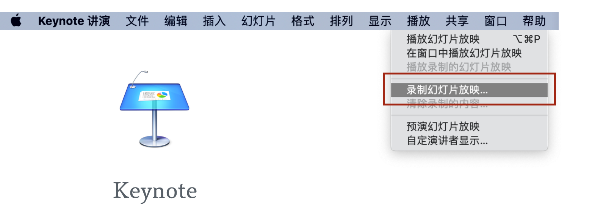
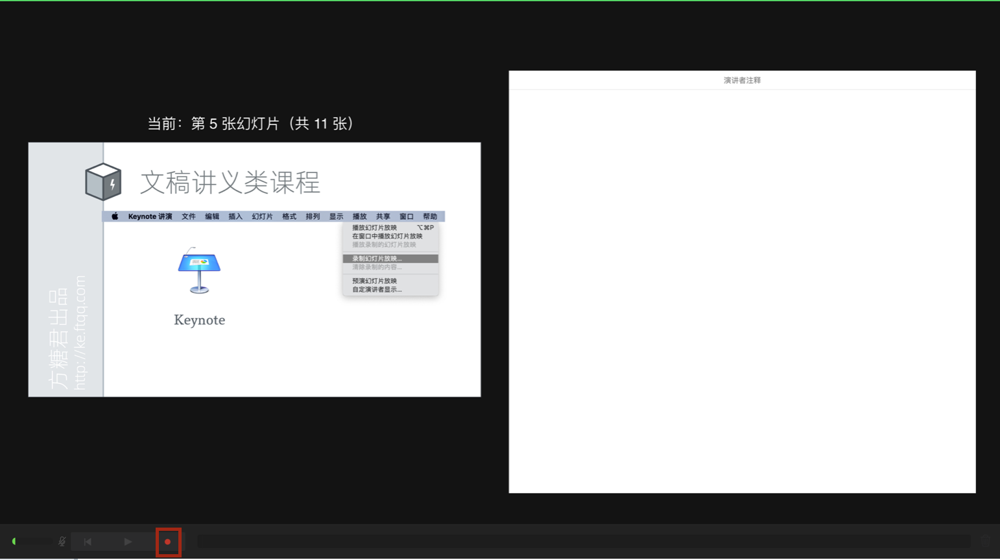
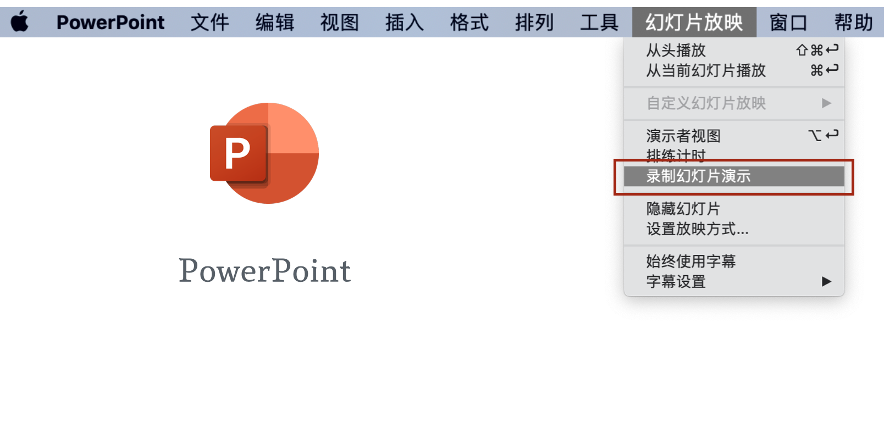
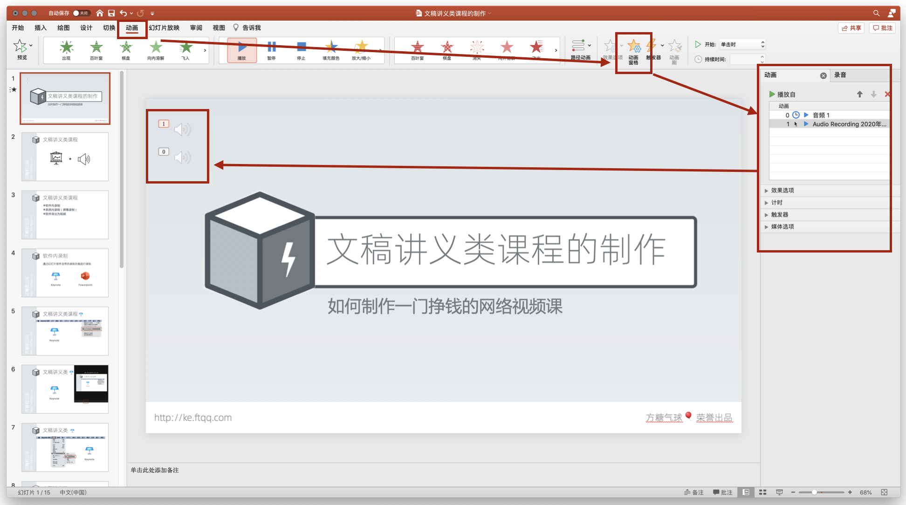
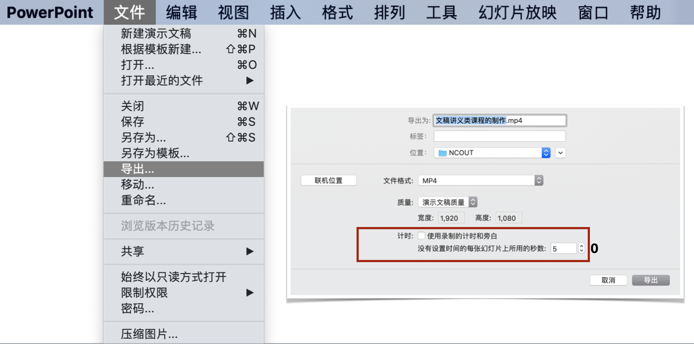

# 文稿讲义类课程片段的制作

这里的文稿讲义，主要指使用幻灯片软件来进行播放的资料。如果是使用PDF这类材料，其实是属于「屏幕录制」类，我们会在下一节里详细讲解。

对于文稿讲义类课程片段，我们的画面、图文内容都已经做到了幻灯片里面，要录制的主要是声音。但我们有三种截然不同的方式来录制声音：

1. 第一种是最通用的，通过全局录屏来完成。不管是使用什么软件，只要在电脑里，都会被录下来。
1. 第二种是使用幻灯片软件自带的「演讲录制」功能来完成。
1. 第三种是最不为人知的，通过幻灯片软件的「导出为视频」来完成，这种方式有一个非常大的优点，可以极大地降低修改成本，在后文中会详细说明

下边我们分别说明。

## 全局录屏

下一节会详细讲，这里就略过了。

## 使用幻灯片软件自带的「演讲录制」功能

  

目前用得最多的幻灯片软件，分别是苹果公司的 Keynote 和微软的 PowerPoint。下边我们就以它们为例进行讲解。

首先，我们需要使用幻灯片软件将内容制作完成。课程完成度越高，修改起来成本就越高，所以要仔细检查有无错别字或其他疏漏，然后再进入音频录制阶段。

### 如何使用 Keynote 的「录制幻灯片放映」功能生成视频课程

我们先来看在 Keynote 中如何录制。

在 Keynote 菜单「播放」里选择「录制幻灯片放映」

  

然后我们就会进入一个深色背景的幻灯片录制的环境，在这个界面的最下方有一个红色的录制按钮。

  

点击它就可以开始进行录音，可以随时暂停和停止。需要注意的是，这里录制的音频不是仅仅当前这页幻灯片的，而是整个幻灯片的。你可以来回切换幻灯片来录制音频，如果界面看到的有些不一样，可以通过调整预览界面的配置来修改。

当我们在录制环境中完成了整个课程的音频录制后，就可以回到主界面。从菜单中选择「文件」→「导出为」→「影片」。

  

这样，Keynote 就会为刚才的录制生成视频。有一个需要特别注意的地方，就是导出窗口中，「播放」选项要选择为「幻灯片放映录制」。

  

如果觉得导出的视频文件过大，可以使用[HandBrake](https://handbrake.fr/)来进行压缩。这是一款开源的视频压缩软件，默认的预置（比如 fast1080p ）就很好用。

  

### 如何使用 PowerPoint的「录制幻灯片演示」功能生成视频课程

下边我们来看 PowerPoint 中如何操作，其实很类似，只是菜单名称和个别细节不同。选择菜单「幻灯片放映」→「录制幻灯片演示」。

 

同样会进入一个暗色的录制界面。

  

在左上角有一个时间正在走，在旁边有控制按钮，可以暂停。默认已经开始录制了，我们可以选择幻灯片进行讲解。全部讲解完成后，一样是导出视频。

  

在顶部菜单中选择「文件」→「导出」。

  

也有一个需要特别注意的地方，就是在导出窗口中要选中「使用录制时的计时和旁白」。

## 幻灯片导出为视频

单从录制来讲，前一种方法就非常方便了，可以说是一气呵成。但如果录制完成后我们发现有几句话讲错了需要修改，那么就相当麻烦了。究其原因，主要在于虽然幻灯片是一页一页的，但音频却是整体录制的，所以音频出问题就只能重录。

那么我们能不能让音频也变成一段一段的，对应到每一页呢？这样我们以后再修改的时候，只需要重新录制那一页的音频。

  

这就是我们第三种方案的思路。Keynote 和 PowerPoint 虽然没有提供分页录制的功能，但它们都能往幻灯片上添加音频，并将其合并到视频中统一输出。

所以我们要做的，就是在每一页幻灯片上，添加上语音讲解的音频。比较方便的地方是，这两个软件都支持直接录制语音讲解，而且一页幻灯片上可以录制多段，还能手工调整顺序。

下边我们来看具体如何操作。

### 如何使用 Keynote 以「导出为视频」的方式生成视频课程

还是先来看 Keynote。第一步依然是制作好图文部分的内容，最好把要讲的文稿放到演讲者注释区域，这样录制的时候可以参考。

然后先选中要添加语音讲解的幻灯片，从菜单中选择「插入」→「录制音频」。

  

在弹出的小窗口中点击录音按钮就可以开始录音。

  

录制完成可以试听，没问题后再插入到当前幻灯片。当一张幻灯片有多个音频时，可以选择右上角的「动画效果」菜单，再点击右下角的「构建顺序」就可以看到当前幻灯片中的音频列表了。被选中的时候，会有蓝色描边，通过拖拽可以很方便地调整顺序。

  

导出和之前类似，还是通过「文件」→「导出为」→「影片」。
  

但需要注意的是，这次在导出窗口中，播放选项要选为「自动播放」。

  

同时，我们还要把下边两个等待时间设置为「0」秒钟。

  

### 如何使用 PowerPoint 以「导出为视频」的方式生成视频课程

再来看看 PowerPoint 里边的做法。给幻灯片添加语音讲义也在菜单「插入」→「音频」中。

  

选择「录制音频」可以直接录制。

  

下边我们看看怎么调整多个音频的顺序。点击「动画」菜单，在右边会出现一个「动画窗格」，再点击它，在最右边就可以看到当前幻灯片上所有的音频的列表。

音频前边还有编号，可以一一对应到幻灯片上的音频。通过调节它们的上下顺序就可以手动的指定最终的音频播放顺序。

细心的同学可能会留意到这些音频都会被放到一个叫做动画的菜单里面，其实这个菜单的功能是指定动画播放的顺序，音频被当做动画的一种，所以也在里边了。通过同样的方式还可以控制插入的视频的播放顺序。

  

最后依然是通过「文件」→「导出」来生成视频，但是记得去掉「使用录制的计时和旁白」前的小勾，同时把「没有设置时间的每张幻灯片所用的秒数」设置为「0」。

  

