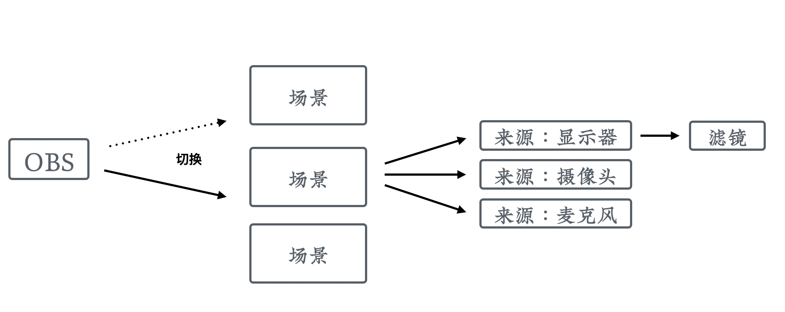

# 屏幕录制类课程片段的制作

## 屏幕录制的原理

屏幕录制软件的原理，是不停地截取屏幕画面，然后和音频合成为最终视频。屏幕录制的优点是可以把电脑屏幕上显示的所有东西都录下来，不管你在哪个应用里边，不受应用本身功能的限制。所以可以非常直观地向学员展示完整的操作。

## 屏幕录制的软件

在试用了很多屏幕录制软件以后，我们选择了 OBS 。它的优点主要有：

1. 功能强大
1. 开源免费
1. 跨平台

### 功能强大

OBS 不但可以录制屏幕，还有一个非常强大的功能就是直播。现在很多视频网站的直播都支持用 OBS 来进行推流。所以学会了它，不但可以录制屏幕，而且可以进行直播，一箭双雕、非常划算。

然后，OBS 可以非常容易地进行屏幕之间的叠加，比如画中画模式，这就非常适合我们马上要讲到的「真人出镜」和「虚拟形象」类型的课程片段。

同时呢，OBS 还支持通过快捷键在各个场景之间来回切换，在录制课程的时候可以非常方便的进行转场，这个功能不少收费软件都没有。

### 开源免费

和那些昂贵的收费软件不同，OBS 是开源而且免费的，这意味着使用它没有任何版权风险。我们在制作付费课程的时候，需要特别留意版权方面的问题。因为平时以个人身份在免费文章和视频中用一些字体、图片是没问题的；但在收费的商业课程中，就可能面临被起诉索赔的风险。

### 跨平台

再来说一下，为什么跨平台的特性非常重要。在课程中，尤其是编程类课程中，我们经常会遇到需要讲解某个工具软件在各个操作系统上的安装和使用的情况，这时候就需要在多个平台上录屏。

如果使用一个特有平台上的录屏软件，在录制其他平台上的课程内容时，就不能使用了。只能重新购买和学习一个新的录屏软件。这不但浪费钱，更浪费时间和精力。

而使用 OBS 就没有这种困扰，它不但支持 Windows 和 Mac 系统，连主流 Linux 系统都是支持的。

所以，在我们后续课程中，将以 OBS 为例进行讲解。

## OBS 的层次逻辑

OBS 的功能非常强大，还有包含了直播相关的功能，所以需要理解它特有的一些概念后，用起来才会更加顺手。

像一般的屏幕录制软件，只需要启动后点击录制按钮，进行录制就完了。但 OBS 中，它有自己的层次逻辑。

  

### 场景

OBS 的第一个层次叫做「场景」，你可以把它理解为一种预设。

为什么需要场景？比如我们一个讲师，他每天上午要进行直播，这个时候视频的来源是摄像头和电脑屏幕；然后他每天下午要录制课程，这时视频的来源就只需要电脑屏幕，但他有两块屏幕，他希望都录进去。

如果没有场景这个概念，那我们每天上午到下午的时候，就需要不停的修改配置，非常麻烦。而有了场景以后，我们只需要把上午和下午定义成两个场景，使用的时候切换下就OK了。

你可能会想为什么要叫「场景」而不是直接叫「预设」呢？因为 OBS 中场景比预设更为常用和强大，它是可以实时切换的。

也就是说，如果我们有三个显示器ABC，可以在场景一里显示A；在场景二中显示BC；然后根据需求通过键盘快捷键来切换，甚至还能给它添加转场特效。

### 来源

  

在定义好「场景」以后，就可以往里面添加「来源」。最常用的来源其实就两类，也就是视频和音频。视频最主要的是显示器，也就是电脑屏幕，偶尔还有摄像头。音频的话主要就是麦克风。

 

来看一下 OBS 的来源菜单。

首先它提供了「图像」和「图像幻灯片放映」，如果我们想在视频上面显示一张固定的图片或者图片轮播可以用它。

比较有意思的是，我们还可以把一个场景指定为来源，这样就可以非常容易地实现场景嵌套。也可以把媒体作为一个来源，这样就会在画面上面播放另外一个视频。

文本来源这里可以输入一些文字，指定它的颜色、字号和字体，然后它就会显示到屏幕上方。可用来显示我们机构的品牌名称之类的。可以看到，一些本来是后期才进行处理的功能，在 OBS 里都可以通过来源来实现。

显示器采集也就是我们的屏幕；视频采集设备通常就是指摄像头；音频输入采集这里通常就是耳机、麦克风或者外接的USB声卡之类。

这里还有一个音频输出采集，可以用来做多层次的音频加工。比如说我们电脑上有一个软件，就像柯南的蝴蝶结一样，可以对输入的声音进行变声，那我们就可以把这个软件的输出作为来源接入到 OBS 里边，录制下来的声音就是变声后的效果。

### 来源的层次

在多个来源之间，其实是有上下层级的概念的。打开 OBS 的来源小窗口，我们可以看见当前已经添加的所有来源。

来源是从上至下进行覆盖的。也就是说来源窗口的最上边一层，在最终视频中也会显示到最上面，上一层的内容会压住下边各层的内容。

  

这个对于我们制作真人出镜类型的课程片段很重要，因为它通常是通过摄像头和显示器两个来源叠加得到的。摄像头的画面小、通常显示在右下角；显示器的画面大，往往覆盖整个视频画面。在来源窗口里，摄像头需要在显示器上层才看得见，不然会被显示器画面完全挡住。

### 滤镜

  

如果通过来源采集的信息不是百分之百符合我们的需求，还可以通过滤镜来进行进一步加工。OBS带有两类滤镜，一类叫做「音视频滤镜」，可以对音视频进行处理，比如进行噪音的抑制或者把音量放大；另一类叫「效果滤镜」，包括各种各样的特效，比如「色度键」可以用来抠背景。

