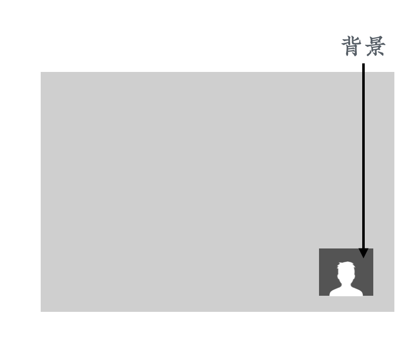

# 真人出镜类课程片段的制作

虽然前面其实已经陆续讲到了真人出镜类课程片段的基本原理，这里还是再明确下。

## 什么是真人出镜类课程片段

「真人出镜」类的**视频**非常简单，只需要使用摄像头、手机或者摄影机直接录制就好了。而「真人出镜」类的**课程**反而要复杂一些。这是因为在课程中，讲师其实并不是主体，课程内容才是。所以我们往往会采用「画中画」的模式，将讲师的头像部分做成一个小方块放到画面中。

  

但这有一个小问题，就是这个方块会带背景。如果它的背景和作为主体的课程不搭，看起来就会比较别扭。要是能把背景变成透明的，它就能更好地融入到课程中。

## 抠图

那么，怎么才能让背景变成透明的呢？答案是「抠图」。对于计算机来讲，将数字内容的一部分变成透明是非常简单的，真正的麻烦在于它不知道哪一些像素是背景、哪一些像素是讲师，所以我们需要一个方式来告诉计算机。

现在最常用的，也是最简单有效的一个办法，叫做「绿幕抠图」。就是在讲师身后放上绿色的背景布，再告诉计算机，绿色的部分都是背景，把它抠掉。这样就实现了背景的透明。

有同学可能会问说，为什么非要绿色，其他的颜色行不行？答案是可以的，但如果把背景设置成黑色，很多人的眼睛和头发都是黑色的，这些部分也会被透明，看起来会很灵异。

而绿色在日常生活中出现的频次比较低，所以一般默认用绿色来作为背景。但如果有天你穿了个绿色的衣裳，那就可以考虑换用蓝色的背景了。

  

这一部分的具体操作是这样：

1. 在场景中添加一个「显示器采集」来源，选为我们想要录制的电脑屏幕，放到来源窗口最底层。
1. 在场景中再添加一个「视频采集设备」来源，选为摄像头，将其放置到屏幕右下方，在来源窗口中位于显示器之上。
1. 在摄像头来源的右键菜单中，选择「滤镜」，在「效果滤镜」中添加一个「色度键」滤镜，背景为默认的绿色。
1. 调整「相似度」和「平滑」的值，让背景消失得更为柔和。

  

  

关掉滤镜窗口，这时候在 OBS 的预览界面上我们看到的摄像头画面背景就应该已经透明了。

  

## 真人出镜的其他细节

如果你是使用笔记本电脑，通常自带一个摄像头；如果是台式机，就需要自己装一个。摄像头需要对着讲师的脸，因为摄像头看到的，就是学员最后在课程里面看到的角度。

然后我们在讲师背后竖一个比较大的绿幕，充满整个摄像头的背景区域。一般两米宽高就够了，不够的话可以调整摄像头。

绿幕可以在电商网站输入「绿幕布」关键词搜索购买。有一些专业的幕布会比较贵，但我们早期可以买便宜的幕布来试水，一般几十块钱就能搞定。

为了让讲师和背景之间分离得更清晰一些，可以再通过光源进行补光。这里我们用手办做了个示意图给大家。这个灯的色温不能调，所以看起来稍微有点偏黄。实际录制的时候，可以用白色的灯来补光。

  

