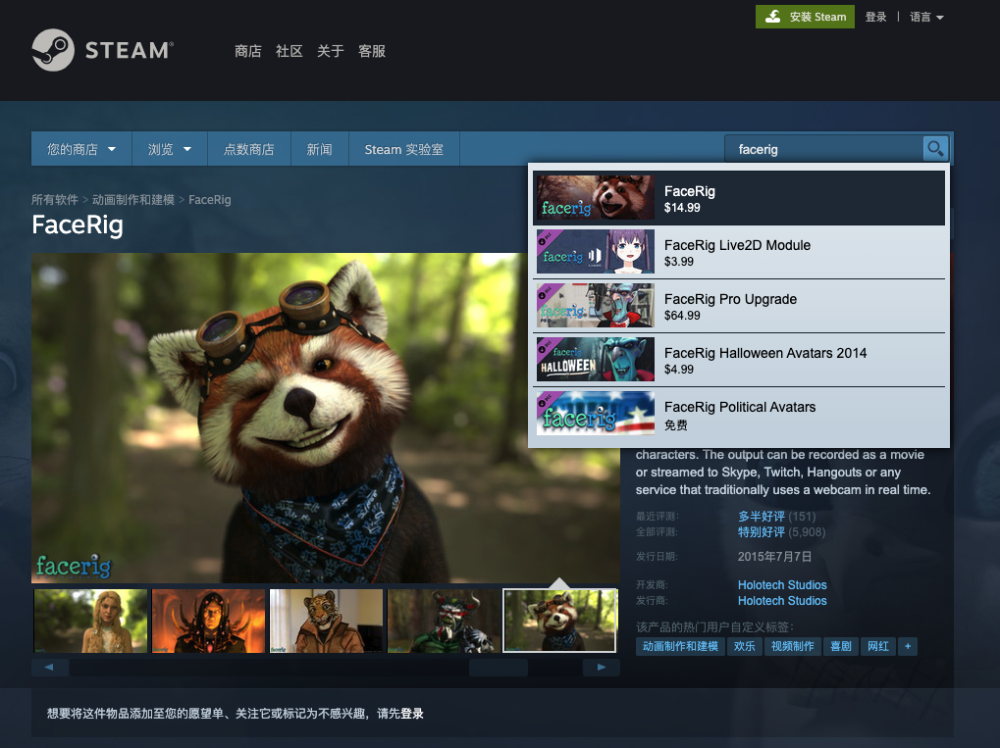
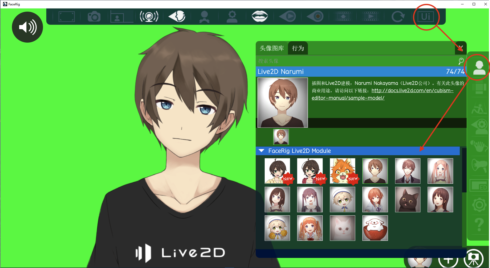
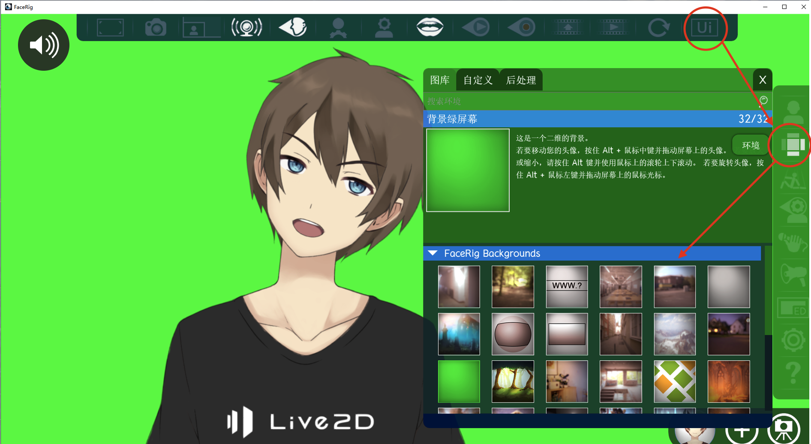
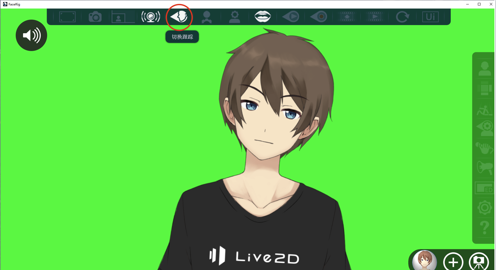

# 虚拟形象类课程片段的制作

## 虚拟形象的原理

最后，我们再来看一下虚拟形象类课程片段的制作。虚拟形象实际上跟真人出镜差不多，但因为可以用卡通的形象来代表真人，所以形式上看起来会更加有意思，更适合年轻的同学。

在上一节里面，摄像头里拍到的是真实的画面，现在我们要想将真实的变成虚拟的，就要使用虚拟摄像头。

所谓的虚拟摄像头，就是其实并不存在这么一个物理上的摄像头，这个摄像头是用软件来模拟的。但是其他软件并不知道，它们会以为这个摄像头是真实的，于是它们之间就可以无缝地进行整合。

## FaceRig

我们使用的是 FaceRig 这个虚拟摄像头软件，它提供了很多的3D模型，还支持导入 Live2D 这个游戏和动画用得较多的模型格式。如果是通过 Steam 购买的 FaceRig，那么在创意工坊里边可以看到全球玩家上传的各种模型，喜欢的可以直接订阅，它就会出现在我们的 FaceRig 里边。

当然，我们也可以制作自己的卡通形象，生成模型并导入。顺便说一下，对于多人参与的课程来讲，虚拟IP是非常有用的。如果我们将大量的精力和推广资源放到真人讲师的IP上面，万一这个讲师离开团队，之前的投入就废掉了，甚至会变成竞争对手的资源。但是如果我们采用虚拟IP，就完全没有这个问题。

### 步骤

为了模拟摄像头，FaceRig 构造了一个 3D 空间。这个空间由「模型」和「背景」两部分组成。选好模型、配好背景，打开跟踪器让模型和我们的表情同步，就实现了用虚拟形象代替真人形象。

下边我们更为详细地讲述下步骤：

1. 购买和安装
1. 选择模型
1. 选择背景
1. 打开追踪器
1. 打开广播

#### 购买和安装

最方便的方式是在 [Steam](https://store.steampowered.com/app/274920/FaceRig/) 这个平台上进行购买，它会帮你自动安装各种依赖，确保能运行起来。如果想用 Live2D 的模型，还需要购买对应的插件。

  

#### 选择模型

启动完成以后，点击顶部菜单最右边的UI按钮就可以切换右侧的面板；这个面板的第一格就是我们的模型。

点开以后可以选择喜欢的模型。

  

#### 选择背景

还是在右侧的面板，第二个图标就是。点开它可以看见预置的各种背景。如果想要最终背景透明，可以选择绿色背景方便下一步抠图。

  

#### 打开追踪器

现在虽然模型都有了，但它跟我们真人说话的表情语气没有关联起来，所以要打开追踪器。点击顶部导航，「切换追踪」按钮（图上画红圈的），摄像头就会通过人脸识别来捕捉我们的表情。这个时候我们摇脑袋和做出各种表情的话，就会同步到模型上。

  

#### 打开广播

这些都做完了以后，一定要记得还有最后一步就是要**打开广播**。所谓广播就是 FaceRig 把画面虚拟成一个摄像头，并同步到整个系统里，其他的软件就会把它当做一个真实的摄像头。

  

打开广播也非常简单，就是点击顶部的这个像电台一样的按钮。点击打开，再点一下关闭。

当广播打开后，在 OBS 里去添加一个新的视频捕捉设备的时候，就会发现有一个名字包含 FaceRig 的摄像头，把它作为来源，就可以引入和真人表情同步的虚拟形象了。

  
