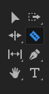
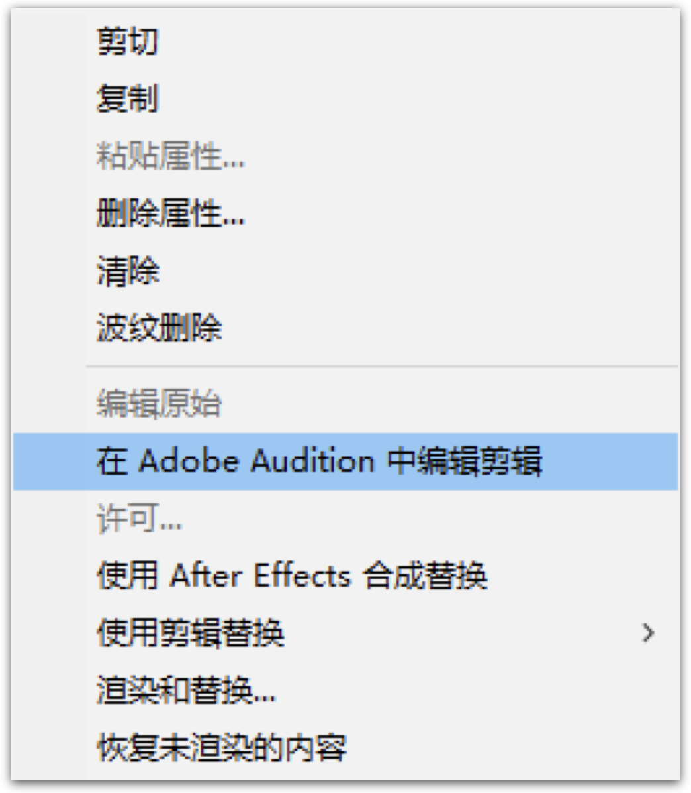

# 最常用的视频剪辑操作

视频剪辑是我们做课时用得非常多的技巧。剪辑是一门细节很多的技术，幸运的是，做课所需的只是非常基础的一些功能，所以我们才有可能花很少的时间学会。这也是我们这一节的内容。

## 剪辑软件

视频剪辑的软件非常多，但整体功能上大同小异。经过一系列的试用，我个人用得最多的是这两个软件：

1. 苹果公司出品的 iMovie
1. Adobe 公司出品的 Premiere（一般简称PR）

iMovie 是 Mac 专有的免费软件，完全可以胜任大部分的常规剪辑工作。后来苹果公司还开发了 iOS 版本，这样我们在 iPhone 和 iPad 上也能使用它。

如果我们只是想简单地调整下视频片段的顺序、删除某个片段、或者对某部分进行速度调整的话，iMovie 是个不错的选择。

PR 则是系统复杂、功能强大的专业剪辑软件，很多专业人士都在使用它。PR 是一个付费软件，但同时支持 Mac 和 Windows。

我们后续以 PR 为例进行讲解，在其他的剪辑软件里相关的操作也是非常类似的，往往只是菜单位置不同，大家可以自行摸索。

## 视频片段的调整

视频片段的调整是最常遇到的需求。因为我们在录课的时候很可能其中有一段讲错了，会想把它去掉，再把后边的内容给接上去；或者讲课时有一部分内容讲丢了，在后边补讲的，想把它给挪到前面去。这些情况时常发生。

比如说我们现在有一段视频，希望删除其中红色的部分，应该怎么操作呢？

  

直观来讲，应该是选中一个片段然后按删除键。有一些编辑软件就是这样做的。但在 PR 中，这个操作通常被分两步：先分段、再删除。

  

所以我们会先用剃刀工具将视频给切割成三段，切割的位置正好在红色部分的开始和结束，这样它就会变成一个独立的片段。

然后切换到选择工具，选择这个片段，再按删除键，片段就会被删除。

  

但我们会发现，视频中间空出来了一段空白。

  

这是因为在 PR 里边，连续视频并不是一种常态，所以它没有自动去掉两个视频片段之间的空白。可以在这段空白上点右键，选择「波纹删除」，这样后边的视频就会自动补上来了。

  

当然，在删除视频的时候，如果不是直接按删除键，而是点击右键，选择「波纹删除」会更加方便一些。

## 柔软的视频片段

这里有一个需要特别注意的概念。在我最初的想象中，视频片段应该是很「硬」的，当两个视频片段有重合时，后一个片段会自动后移并紧跟前一个视频对齐。但在 PR 中，视频片段是很「软」的，当两个片段重合的时候，重叠部分会被覆盖掉，再也分不开了。可以把它们想象成两个透明胶带，一旦粘上，就很难无损分开了。

  

所以，对于不熟悉 PR 的新手来讲，想要两个片段紧密连接，最简单的方式还是分开放，然后「波纹删除」中间的空白来自动对齐。

## 视频片段顺序的调整

正因为这些片段很「软」，当我们在进行顺序调整时，也要倍加小心。这里我们可以利用 PR 的多轨道。我们可以暂时把要移动的片段放到另一个轨道上，然后调整原来轨道上片段的顺序，挪出一个新的位置，再从外轨上把片段给挪回来。

  

## 视频片段速度的调整

速度调整在做课时也很常见，比如说我们通过网络安装软件的时候可能就很慢，得操作二三十分钟，但我们不可能让学员一直等二三十分钟。一个方式是直接减掉这个过程，但如果其中又包含了一些操作细节，我们可能就需要把这一段视频加速。

  

在需要调整速度的视频片段上边点击右键，选择「速度/持续时间」选项，会弹出设定窗口。
窗口上默认的速度是100，如果想加速，就改为大于100；想减速，就小于100。

有一个需要注意的问题，就是如果减速，视频片段会变长。如果前后有其他片段，就可能造成覆盖，所以这种情况下，最好放到另一个轨道上再调整速度。

另外，在加速的时候，原来的声音会变调，如果想要保持正常，记得选中「保持音频音调」。

## 视频中的音频处理

这个操作也是很常见的，比如讲课中有几句讲错了，但是不方便删除视频，可以只删除这一部分的音频。

但是，默认情况下，音频和视频是绑定的。所以我们需要将要处理音频的部分切割成独立的片段，然后在右键菜单→「音频增益」中把它的音量调到听不到（比如-100dB）。

当然我们也可以通过选中片段后点右键菜单，选择「取消连接」来解除音频和视频的绑定。这样就可以随意编辑音频了。

除了像视频一样分段、调整顺序等，我们可能还需要对音频进行去噪、调音等更进一步的操作，这时候我们可以在对应的片段上点击右键，选择「在 Adobe Audition 中编辑剪辑」在另一个软件中来处理。具体的操作我们将放到下一节讲解。

  
