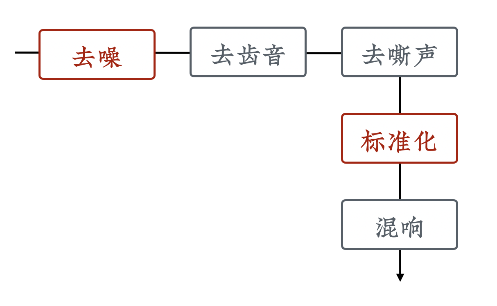

# 最常用的音频处理操作

音频的后期处理和视频类似，也是非常专业的领域，所以我们这里也只讲最简单的处理。在我们做课时，经常会用到的技巧主要包括：

1. 去噪
1. 标准化
1. 混响
1. 去齿音和嘶声

下边我们依次来看看。

## 去噪

「去噪」就是「去除噪音」。一般分为两个步骤：

1. 定义噪音
2. 去除噪音

为什么会有「定义噪音」这个步骤呢？因为对于计算机来讲，它并不知道哪一部分声音叫做噪音。
比如我们在录一首歌的时候，邻居家的猫在旁边叫，这个声音就算是噪音。但如果是想录一个宠物视频，猫在里面就不是噪音，它可能是主角。所以是否是噪音，是需要根据场景来进行定义的，计算机理解不了这点。

当然，这个例子比较特殊。通常来讲，要去掉的噪音叫做「底噪」。就是声音很小的背景噪音，比如电流声，远处汽车和行人的声音。这种时候，只需要选取一段只有这些背景音的音频，将其定义为噪音，那么软件就可以把和它类似的声音去掉。

音频处理也有很多软件能做，但因为我们视频剪辑用 PR，所以音频用 Audition（简称 AU ）来做会更为方便。它在我们修改音频后，会自动更新 PR 里边的片段。

下边我们来看 AU 中具体怎么操作。首先选中一段只有背景噪音的音频，在顶部菜单中选择「效果」→「降噪/恢复」→「捕捉噪音样本」，就可以把它定义为噪音。

  

然后，在顶部菜单中选择「效果」→「降噪/恢复」→「降噪（处理）」，开始去噪。

  

记得在弹出的窗口中点击「选择完整文件」，再点「应用」就会开始处理。

  

## 标准化

标准化也是一个很有用的功能。我们录音的时候，尤其是换了场地和设备录音的时候，可能声音的范围（最高音和最低音）就不一致。这种时候，就需要通过「标准化」来将这个范围统一，这样听起来音量差异才不至于太大。

  

在 AU 中的具体操作如下：

在顶部菜单中选择「效果」→ 「振幅与压限」→「标准化（处理）」。

  

然后在弹出的窗口中，可以将其标准化到 0 dB （如果觉得音量过大，也可以试试 -6 dB）。

  

## 混响

我不知道大家有没有这种感受，就是有时候听一些电脑生成的音频时，会觉得声音非常纯粹，很好听，但听起来不像是真的。而一些现场录制的音频，音质可能没那么好，但听起来却会有种非常强的空间感。

这是因为我们日常在说话的时候，声音会分成两个层次到达我们的耳朵。

  

一个层次是直接从发声处传到了耳朵里，另一个层次是声波打到周围的环境上，比如墙面、地面、桌椅上，被反射后，有一些很弱的声音以稍微延迟一点的时间进入我们的耳朵。我们日常听到的多是这种叠加后的声音。

在电脑中生成的音频如果不特意处理，是没有这种叠加的。这就让声音有点「平」或者「干」。为了增强声音的空间感，很多编辑软件提供了叫做「混响」的功能。其原理就是模拟现实中的声音叠加，将一部分声音强制延迟后混音，这样的声音更有立体感。

下边我们看看在 AU 中怎么具体操作。

在顶部菜单中选择「效果」→ 「混响」→「混响」。

  

在弹出窗口中，可以调节各项参数。点击播放按钮可以试听。

  

选择好以后，点「应用」进行处理。

## 齿音和嘶声

齿音是指我们说话时，呼入呼出的气流和嘴唇、牙齿之间摩擦产生的声音；嘶声则有些类似于广播电台中常听见的嘶嘶嘶的声音。这些声音混在音频中，可能听起来不那么舒服，所以 AU 也提供了工具来清除它们。这部分的操作很简单，这里就不详细说明了，这两个功能的菜单分别在：

- 齿音：「效果」→「振幅与压限」→「消除齿音」
- 嘶声：「效果」→「降噪/恢复」→「降低嘶声」

## 建议顺序

其实顺序并不是强制的，怎么都行。但考虑到标准化时有可能把底噪放大，所以我一般会按下图的顺序来进行各项音频处理操作。

  

整个过程中，去噪和标准化才是最重要的，其他的三项时间紧张时可以偷懒不做。