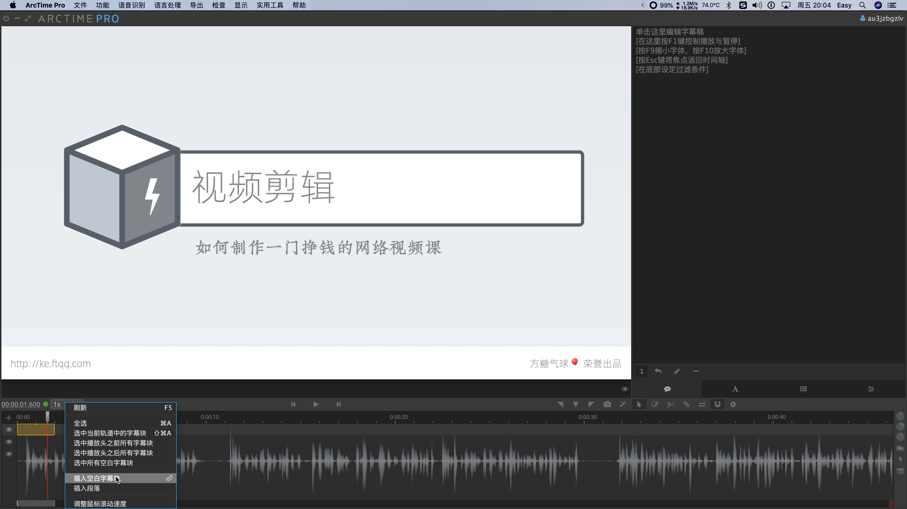

# 字幕的制作和自动生成

对于技术类课程来讲，字幕是非常有用的。一些技术名词光是读出来，有时候很难明白它是什么意思。而如果有字幕，就可以一目了然了。

## 字幕及其格式

所谓字幕呢，是指我们在播放视频的时候，显示在屏幕下方的、和语音同步的文字。为了让计算机正确地显示出字幕，我们需要告诉它两个信息：

1. 这个字幕的文本是什么
2. 这个文本应该在什么时间开始显示，在什么时间结束

也就是说，最基本的字幕信息应该包含「文字本身」以及「文字显示的时间段」。

当我们把多条字幕的信息合并放到一起，就有了字幕文件。字幕文件可以是单独的文件，在播放视频时载入并显示，这种方式称为「外挂」；也可以在压制视频时直接压制到视频里，这样即使播放器不支持字幕功能，也可以正常显示。

字幕的格式有很多种，srt 格式是最简单的格式之一。

  

它由多段文本组成，每段文本分为三行：

1. 第一行是序号，一般从 0 开始递增
1. 第二行是显示时间段，中间用箭头分隔
1. 第三行是这个时间段应该显示的文字

## 字幕编辑软件

我们使用的字幕编辑软件是 [ArcTime](https://arctime.org/)，它是一款跨平台的免费软件。启动以后的界面是这样的：

  

左上部分区域是视频的预览区，可以从顶部菜单的「文件」→「导入音视频文件」载入要编辑字幕的视频。然后它就会显示预览区。

预览区下方就是字幕区，有根据音频生成的波形在上边。在这个区域点击右键，选择「插入空白字幕」，就会插入一个空白的字幕条，双击可以输入字幕，拖拽可以调整显示的时长和起止时间。

添加好字幕以后，点击预览区的播放按钮，可以实时地看到新添加的字幕效果。需要注意的是，目前的版本中，删除某条字幕的操作是不能撤销的。这可能是这个软件为数不多的缺点了。

整个视频的全部字幕添加完以后，点击顶部菜单中的「导出」→「字幕文件」就会将刚才编辑的字幕生成一个字幕文件了。

 

如果想要把字幕直接压制到视频里边，则可以选择「快速压制视频」选项。

## 字幕的自动生成

ArcTime 还内置了一个为视频生成字幕的功能，放置在「语音识别」菜单中，但这些功能是收费的。

对于程序员来讲，有一个更为廉价的方式获得同样的效果，那就是直接写代码去调用云服务商提供的 API。比如[阿里云](https://ai.aliyun.com/nls/filetrans?spm=5176.12061031.1228726.1.47fe3cb43I34mn)、腾讯云和[百度翻译平台](http://api.fanyi.baidu.com/api/trans/product/index)就提供了相关接口。

更有开发者已经在 [GitHub](https://github.com/wxbool/video-srt-windows) 上开源了基于这些接口的命令行和客户端软件。大家可以在 GitHub 搜索「VideoSrt」，自行安装试用。

  
