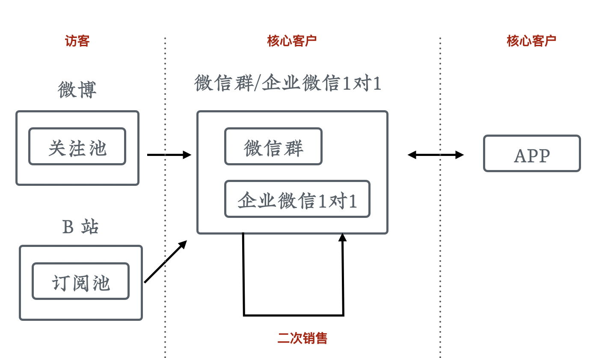

# 流量池和二次购买

课程制作完成上线以后，并没有结束。长征才刚刚开始，我们需要不断得去运营它。这一节就来聊一聊流量池和二次购买。

## 没有流量池的情况

先来看一下在没有流量池的情况下，课程转化是什么样子的。

  

首先，我们将自有的或者购买的流量引导到课程页面，以触发销售转化。但如果我们没有采取更多措施，之后这个流量就走掉了。当上架新课时，又需要重新寻找或购买流量。

这种方式优点是简单，但今天操作起来问题很大，因为我们已经错过了之前流量爆炸的时代，现在流量已经很贵了，这么浪费太可惜。那么，能不能把流量囤起来，供以后使用呢？

## 学员池

  

最简单的操作就是，把购买过课程的学员放到「学员池」里。当上架新课程以后，可以直接给他们发通知进行销售。这样就实现了流量的二次使用。很多同学觉得这是显而易见的，但事实上在操作的时候却很容易出问题。

比如说，很多讲师只是直接使用课程平台进行学员管理，而很多的平台不允许讲师给学员批量发送私信，甚至还会做关键字过滤。这种情况下，我们对学员的触达能力是非常弱的，需要建立更可控的流量池来替代。

## 访客池

  

学员池重用了已经购买过课程的流量，但更多的没有购买课程的访客流量还是流失了。所以我们还可以更进一步，来做访客池。

把我们课程中有意思、有传播点的内容做成免费的素材，进行多渠道分发，把用户吸引过来并放到这个池子里，以备以后发送通知、触发销售。

常用的渠道包括：

1. 搜索引擎
1. 社交网络
1. 媒体平台
1. 课程平台
1. 行业网站

学员池和访客池是我们最主要的两种流量池。

## 构造流量池的工具

互联网发展到现在，各种产品已经极大的丰富，所以有大量的工具可以用来构造流量池。因为课程销售有非常明确的商业诉求，所以我们对流量池也有相对明确的评判标准。这里分享下我常用的三个标准：

1. 进入门槛低：最好能免除用户注册，尽快获得用户的基本信息和触达权限
1. 可触达率高：这样我们的销售信息才能被更多人看到
1. 触达免费或廉价：太贵了用不起

如果想要获取种子用户用来验证大纲，还需要考虑互动性。

针对微博、公众号、企业信号、微信群、自建 APP 这几种最常用的方案，我们整理了一个对比表格以供大家参考：

  

## 多级流量池

各种流量池都有自己的优缺点，我们应该选取当前阶段最适合的来进行流量的存储。我们也可以分阶段、渐进式地建立多级流量池，以在投入和收益上获得平衡。

比如早期我们可以直接使用微博的关注、哔哩哔哩的订阅来做流量池；然后将一部分核心用户引导到微信群和企业微信一对一服务中。这样把微博的获客门槛低和微信的触达率高这两个优点结合起来了。

在用户规模大一些以后，我们再去开发自己的App，实现对用户流量更高级别的控制。

  

