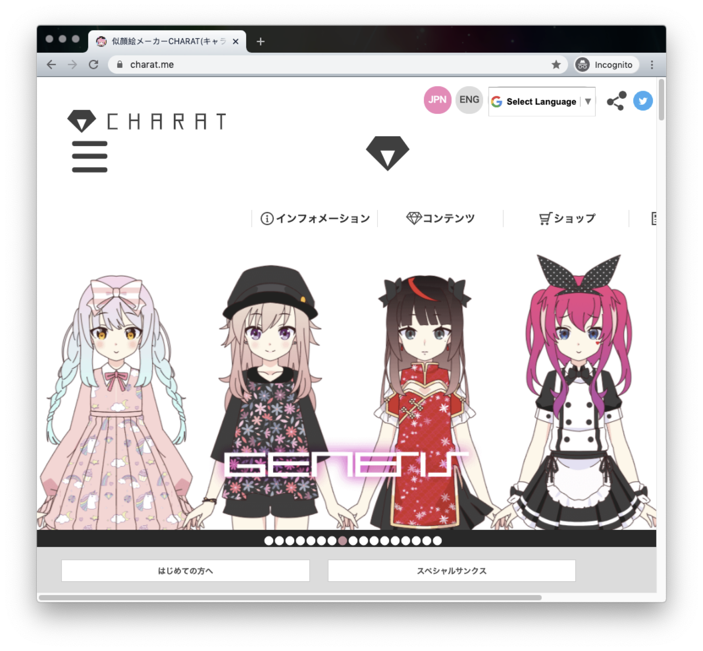

# 通过用户画像细化客户

## 什么是用户画像

在商业模式画布里面，我们对客户进行了细分，把客户分成了不同的组，每一组代表一个独立的需求。

用户画像（persona）呢，就是给这些已经分好的组，每一组搞一个人设、建一个虚拟形象，让其变得有血有肉、有姓名有年龄有性别、有自己的身份有自己的爱好、有使用产品的场景。

这样当我们聊到这个用户画像的时候，就像在讲自己的朋友、同事一般熟悉的人一样。

把抽象的需求变成活灵活现的人，这样我们在进行产品设计的时候，就更容易还原到场景，带着画面去想象这个人的需求和行动，这就是用户画像的意义。

## 福利单词的用户画像

接下来，我们就在福利单词的客户细分基础上，为每一类客户建立用户画像。

### 四六级备考生

首先是备考四六级的大学生这个细分客户群。我们叫他王小康，设定为一个大三的男生。他现在有一个迫切的任务，就是一定要通过四级考试。这位同学是一个动漫宅，他喜欢看的图就是二次元的萌妹子。

### 留学移民预备军

然后我们来给有留学移民需求、需要考雅思和托福的人群做一个用户画像。我们叫她章小留，她是一个大学刚毕业一年的女生，现在有出国留学的想法，正在准备雅思考试。这位同学是追星族，喜欢看的图片是韩国帅哥。

### 专业提升小白领

第三个细分人群的用户画像，我们叫她卢小白，是一个毕业两年左右的女生。在生物公司从事技术相关的工作，她需要尽快熟悉大量的生物专业方向的英文单词，方便她更好地了解公司业务。她家里有猫，喜欢看的图片是萌宠和美食。

确定了这三个用户画像的基本资料以后，我们会给他们配上头像，写上他们的需求关键字，把它整理到一页A4纸上。

这样我们就可以把它打印出来，贴到墙上，在做产品设计的时候可以随时去看他们，就像看着我们身边的熟人一样。

## 画像的头像制作

很多书里面都强调说，用户画像的头像要尽可能真实，最好用真人头像。但需要注意在网上乱找真人头像容易导致肖像权问题，这里给大家推荐一个通过AI生成真人头像的网站，叫做 thispersondoesnotexist.com。

  

不过这个网站生成的多是欧美人，对国内的产品来讲，反而各种违和。我更喜欢使用日系的动漫捏脸网站来做，比如 charat.me 这个网站。

  

## 最终的用户画像

有了头像，再配上角色的说明和需求关键字，我们就有了一个简单好用的用户画像。下边是我们制作好的三个画像：

  

  

  
