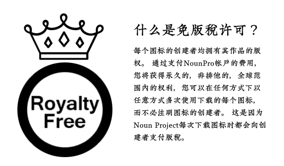

# 独特Logo解决方案

接下来讲下，如何设计产品的 Logo 。

## 为什么要自己设计 Logo

最简单的方式当然是请设计师来设计，我们只需要像产品经理那样在背后指指点点，改需求、当甲方就好了。但是，在做副业时，我们很可能没有足够的预算去雇佣专业的设计师。尤其是在软件还没有获得收益之前，如果花很多钱去请设计师设计，而产品本身又运营不起来的话，钱就白花了。

所以，学会自己做一些比较简单能用的 Logo 还是很重要的。等以后挣钱了，可以再花大钱请高手来重新设计。

## 通过矢量软件绘制 Logo

Logo 的设计还是有些考验绘画能力的，即使是相对简单的简笔画，对于很多没画过图的程序员来讲，也挺难绘制一个像样的出来。

如果你有一定的绘画基础，或者想发掘自己隐藏的天赋，那么我特别建议大家用矢量软件来绘制，对于像我这样手残的同学来讲特别有用。

我最开始画 Logo ，是给自己的开源项目。刚开始使用的是像素绘图软件。由于缺乏练习，即使使用数位屏，也很难绘制出光滑的线条。即使偶尔画出来了，要调整它时，又会花费大量的时间。

后来我发现了矢量绘图软件，在它里边，我们绘制的其实不是线条，而是一个个形状。线条是我们指定的形状的边界，可以通过描边自动生成。最棒的一点是，当我们改变形状时，线条就自动随之变动，无需再重新绘制。

只要熟悉了形状的画法，我们就可以通过矢量绘图软件来绘制一些简单的、线条光滑饱满的图案了。

  

作为对比，上图左边是我用像素绘图软件绘制的头像，右边是后来我用一个周末学习完矢量绘图软件后花一天时间重新绘制的。真的是好用太多了。

## 免费和开放的矢量资源

当然，不是所有同学都有时间和精力去学习绘图的，所以我们还是回到适合更多人的方案上来。首先，我们可以使用网上的开源矢量资源。最近两年开始出现一些视觉效果非常不错的矢量插图网站。

  

比如 [unDraw](https://undraw.co/)，它就提供大量的适合互联网和软件场景的开源矢量插图。更贴心的是，在网站右上角还提供了颜色按钮，通过调整颜色，我们可以得到和自己产品风格更为统一的矢量图。

一个需要注意的地方是，如果使用免费素材，一定要留意不要从国内那些没有注明作者和授权的网站上下载。因为这些来历不明的素材很可能给你带来版权风险，说不定哪天巨额索赔就找上你了。

## 购买付费素材

如果没有好的免费备选，或者没有太多时间去各个网站上挑，我们还可以通过购买的方式来获取素材。

  

在购买素材的时候，要注意使用的限制。有的网站的素材是会限制使用的项目数、域名、甚至媒体类型的。我推荐大家优先购买采用「royalty-free」许可的网站。这种许可非常开放，往往只要付费就可以永久使用。

提供付费矢量图标的网站比较多，比如 flaticon.com ，thenounproject.com 都是比较有名的。我个人一直订阅的是后者，提供的图标够多，价格也比较便宜。它还提供了一个电脑客户端，可以很方便的搜索、复制粘贴图标文件。

这个网站目前提供的图标都是没有颜色的。当然这一点可能对我们来讲，并没有太大的影响。为什么呢，因为直接使用这些网站上的图标做 Logo ，会带来一个潜在的问题。

## 将付费素材变成独有的

这种买断式授权的素材非常好用，但是既然我们可以花很少的钱来买这个设计，那同样的，其他人也可以来买这个设计拿去使用。正如许可中指出的，这种许可是非排他的。

如果这些图标只是用到界面上，多个应用之间相似甚至相同，可能还是好事，因为这降低了用户的学习成本。但如果用在 Logo 这种代表品牌的场景，就会出现多个应用 Logo 一样的尴尬场面。

只是从这种买断式素材网站上直接买一个素材就拿过来把它作为 Logo，那人家也可以从这个素材网站上买同样的素材作为它的 Logo。这种行为可能是无意的，也可能是有意的。这种情况下我们还不能说人家抄袭侵权，因为都是从同一个地方买的，你可以买，人家当然也可以买。除非你把这个图案拿去抢先注册了商标，否则就会存在潜在风险。

不过，我们可以通过混搭组合的方式，将 Logo 变得独一无二、且更贴近我们产品的本质。

你看，thenounproject.com 上有上百万的图标。我们单独使用，总有其他的用户和我们一样喜欢上某一个图标，并把它作为 Logo，这个时候我们两个产品就冲突了。

但是如果我们把这几百万的图标混搭组合起来，就会产生出上亿种组合，再要想重复，就变得非常困难了。而「从一个图案里边截取一部分，跟其他的地方拼合起来，构成一个新图案」的这种操作，即使对于一个没有绘画功底的同学来讲，只要能熟练地使用软件，也可以轻易完成。

另外，在增加识别度方面，除了混搭，还可以通过上色来实现。单色图标因为使用的颜色数少，往往比较单薄，看起来缺乏层次感。当我们把它作为产品 Logo 的时候，可能就不是那么耐看。这时候我们可以自己来给它上色。因为是矢量图标，所以调色和上色都非常简单。调色只要选中后改变线或者形状的颜色就可以。

