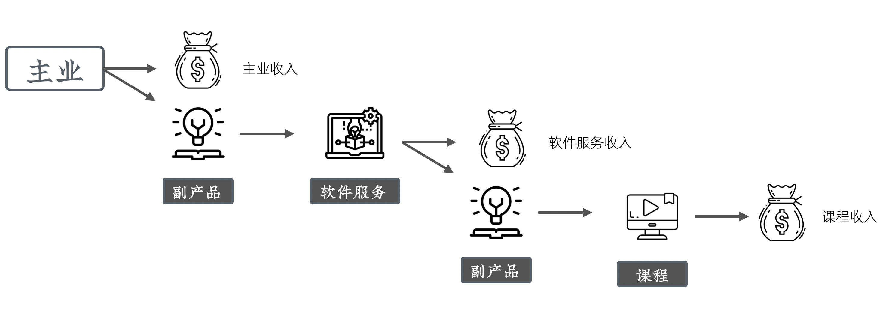

# 网课+独立开发的双引擎副业模式

前面我们通过两个大章节的实践课程，为大家详细讲解了怎么通过独立开发和网络课程制作来发展副业。之所以会选择这两个方向，除了它们非常典型、有很高的投入产出比，还有一个原因 —— 它们之间可以形成非常好的互补。

目前看来，在国内要通过独立开发赚到一流企业程序员的年收入（大致三十到五十万），还是比较困难的。免费加收费模式虽然后期收益巨大，但前期需要长时间的投入。

相对而言，网络课程的售卖更容易带来现金收益。如果我们把独立开发的整个过程完整的录制下来，并加工成网络课程进行销售，那么即使独立开发项目最终难以通过销售软件和服务来赚取足够多的收益，我们还可以通过网络课程获得收入。

而且，不管对于课程学员还是独立软件/服务使用者来讲，都更有益。课程的学员可以学到更为真实、更贴近一线、且经过事实验证的开发技巧；软件/服务使用者则可以获得详尽的文档、架构说明，更有机会进一步深入了解整个规划、设计、开发过程，充分理解业务，甚至因此变成代码贡献者。

从流量上讲，软件/服务可以给课程带来学员；课程可以给软件/服务带来用户。两者互相促进，为我们的副业更添了一层保障。

  

最终，我们就可以实现一个多次利用「副产品优势」的三级收入模式。在这个模式下，我们首先通过主业赚取最核心的收益，以供日常生活和基本发展。然后，我们在主业工作中积累的知识、经验、人脉基础上，开发我们的副业，比如独立软件或服务。在独立开发的过程中，我们再次把它的副产品——制作过程，录制成课程进行售卖。最终，我们可以分别从主业、独立开发以及课程三个渠道获取收益。

这样即使某些收入源不是特别好，我们的整体收入还是相对高的，这就让我们有足够的时间和资源去修正这些错误，让整体发展得越来越好。